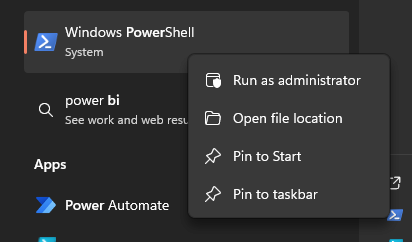

# <p align="center"> Teste Casas Bahia </p>


## Descrição

Este repositório contém o código-fonte do projeto de teste para o cliente Casas Bahia, desenvolvido com o objetivo de automatizar testes utilizando Cypress.

### Cenários de Teste

Aqui estão alguns cenários de teste escritos em Gherkin que cobrem funcionalidades do BugBank:

### Páginas

- [Login](test/cypress/e2e/features/login.cy.js)
- [Cadastro](test/cypress/e2e/features/register.cy.js)
- [Transferência](test/cypress/e2e/features/transfer.cy.js)

### Cenários (Guerkin)

## Cadastro

```gherkin
 Dado que sou um novo usuário do BugBank
 E quero fazer um cadastro
 Quando tento fazer meu registro
 Então ele é feito com sucesso

 Dado que sou um novo usuário
 E quero fazer um cadastro
 Quando tento fazer meu registro sem um nome
 Então recebo mensagem de erro 'Nome não pode ser vazio'
```

## Login

```gherkin
 Dado que sou usuário do BugBank
 Quando faço o login
 Então logo com sucesso

 Dado que sou usuário do BugBank
 Quando tento fazer login sem meu email
 Então recebo mensagem de erro 'Usuário e senha precisam ser preenchidos'
```

## Transferência

```gherkin
 Dado que sou usuário do BugBank
 E faço o login
 Quando tento fazer uma transferência para uma conta aleatória
 Então recebo mensagem de erro 'Conta inválida ou inexistente'
```

### Estrutura do Projeto

```bash
CB-TESTE
├──.github
│   ├── workflows
├── readme-img/
├── test
│   ├── cypress
│   ├── cypress.config.js
│   └── package.json
├── .gitignore
├── instalador_bugbank.ps1
├── instalador_testes.ps1
└── README.md
```

## Pré-requisitos

Antes de começar, você precisará ter instalado em sua máquina as seguintes ferramentas:

- [Git](https://git-scm.com)
- [Node.js](https://nodejs.org/)
- [Cypress](https://www.cypress.io/)

Caso você não tenha algumas dessas dependências, os scripts de inicialização irão lembra-lo de instalar. Além disso, é bom ter um editor para trabalhar com o código, como [VSCode](https://code.visualstudio.com/).

## Instalação

Siga os passos abaixo para instalar e configurar o projeto localmente:

1. Clone este repositório:
   ```bash
    git clone https://github.com/rtupiii/teste_cb
2. Acesse a pasta raiz onde você fez o clone e abra o PowerShell no modo administrador:
    

3. Dentro da pasta raiz, inicie os scripts de instalação:
    ```bash
    .\instalador_bugbank.ps1
    ```
    
4. Em outro terminal, nos mesmos moldes do anterior, rode o segundo script:
   ```bash
    .\instalador_testes.ps1
    ```
    

5. Vá até a opção E2E Testing dentro do Cypress Runner:

    

6. Escolha seu navegador preferido (todos meus testes ocorreram em Chrome) e logo após, a suite estará disponível para ser executada:

    

## Usando sem o Runner

⚠️ **Atenção:** Só será possível rodar sem o Runner após a instalação com os scripts .ps1 corretamente acima.

Você também pode utilizar o Cypress por script, direto do seu terminal de preferência com tags (Disponíveis: @login, @cadastro e @transferencia):
```bash
npx cypress run --env grep=@'CENARIO_DESEJADO'
```
ou 
```bash
npx cypress run
```
Para trocar o browser adicionei a tag --browser (Disponíveis: edge, chrome e electron):

```bash
npx cypress run --browser 'BROWSER_DESEJADO'
```

### GitHub Actions

- O GitHub Actions foi configurado para que sejam rodados todos os testes a cada commit na branch 'main' e diariamente às 08h da manhã.
- Estão disponíveis em [Cypress Tests](.github/workflows/cypress-tests.yml) e [Daily Workflow](.github/workflows/daily-workflow.yml)
- São gerados vídeos e evidências de todos os testes que ficam disponíveis em [GitHub Actions](https://github.com/rtupiii/teste_cb/actions)

### Bugs encontrados

Apenas um Bug foi encontrado durante os testes pois foquei muito mais na arquitetura e reutilização de código do que no teste em si (que acredito ser o principal e mais fácil de continuar a partir daqui):

- Esse bug está relacionado à criação de conta com caractéres acima do normal. Por padrão, eu tentei criar uma conta com um número muito maior de carácteres, números, caractéres especiais e espaços. Todos foram aceitos e a conta é criada normalmente. Esse cenário pode ser visto no [Cadastro](test/cypress/e2e/features/register.cy.js), onde adicionei um "cy.log" que adiciona uma mensagem durante os testes para que fique claro o falso positivo.


- A reprodução do erro consiste em:

Acessar página em: http://localhost:3000/ > Botão 'Registrar' > Completar todos os campos e no campo nome você pode colocar uma frase, números ou caractéres especiais > Botão 'Cadastrar'

- O padrão deveria ser um pop-up de erro, mas o enviado é um de criação bem-sucedida:


